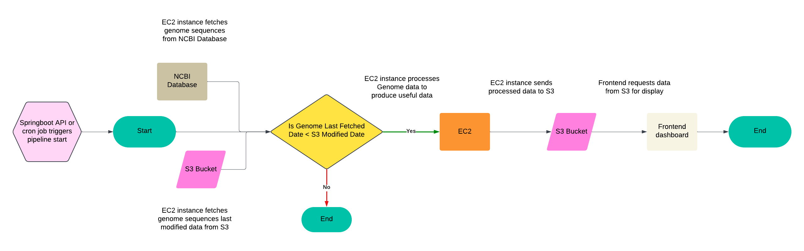

# HelixStream: A Bioinformatics Pipeline for Analyzing Viral Evolution

## Overview

Welcome to **HelixStream**! HelixStream is a scalable bioinformatics pipeline for analyzing genetic mutations and evolutionary patterns in viral genomes, including SARS-CoV-2 variants like Omicron. It leverages AWS S3 for scalable storage, IAM roles for secure access control, and EC2 instances for automated data ingestion and processing. The pipeline aligns sequences and computes mutation metrics using Python, Biopython, and Clustal Omega, while the Spring Boot API orchestrates data processing. A frontend display of the data is provided [here](https://www.helixstream-demo.com/).

## Table of Contents

- [Pipeline Architecture](#pipeline-architecture)
- [Features](#features)
- [Tech Stack](#tech-stack)
- [Future Improvements](#future-improvements)

## Pipeline Architecture

  

### Key Components of the HelixStream Pipeline:
1. **Data Source: NCBI Database**  
   - Source of raw viral genome sequences.  
   - Sequences are fetched programmatically using bash scripts on AWS EC2.

2. **Ingestion Layer: EC2 Instance**  
   - Automates data fetching and uploads raw genome data to AWS S3.  
   - Processes are triggered via a manual Spring Boot API call or scheduled cron jobs.  
   - The EC2 instance assumes an IAM role with minimal permissions, granting it access to fetch data and upload results securely to S3.

3. **Storage Layer: AWS S3**  
   - Scalable storage for raw genome data and processed results.  
   - Organized using prefixes for efficient data management.  
   -  Bucket policies and IAM roles enforce strict access control, ensuring only authorized services (like EC2 or the API) can access the data. Server-side encryption (SSE) protects data at rest.

4. **Processing Layer**  
   - Python scripts (with Biopython) and Clustal Omega perform sequence alignment and calculate mutation metrics.  
   - Scripts running on the EC2 instance leverage the instance's IAM role to access raw data from S3 and upload processed results back to the bucket.

5. **API Layer: Spring Boot**  
   - Facilitates interaction with the EC2 instance to trigger ingestion and processing tasks.  
   - Provides endpoints for securely retrieving processed data from S3.  
   - The API assumes an IAM role to securely interact with S3 buckets and EC2 instances.

6. **Visualization Layer: React Dashboard**  
   - Displays mutation metrics and evolutionary trends.  
   - API endpoints use secure authorization mechanisms token-based access to ensure proper authentication before data is retrieved.

---

### Data Flow:
1. Genome sequences are fetched from the **NCBI database** using Linux scripts running on an AWS EC2 instance.
   -  The EC2 instance assumes a role to securely fetch data from NCBI and upload it to S3.
2. The sequences are uploaded as raw data to an **AWS S3 bucket**.
   -  Bucket policies restrict access to specific roles and services.
3. **Python scripts** align the sequences, calculate mutation metrics, and clean the data.
   - : Secure access ensures only authorized EC2 processes interact with S3 buckets.
4. The processed data is stored back in **AWS S3** for scalable storage.
5. Data is made viewable via the React dashboard, which retrieves it using API calls to the **Spring Boot backend**.
   - API calls securely fetch data, ensuring proper access control and encryption.

---

### Scalability and Security:
- **Scalability**:  
   - AWS S3 dynamically scales with data volume, while EC2 instances can be horizontally scaled.  

- **Security**:  
   - **IAM Roles**:  
     - The EC2 instance assumes an IAM role with limited permissions to interact with S3.  
     - The Spring Boot API uses IAM credentials to securely manage data access.  
   - **Bucket Policies**: Enforce least privilege access for S3 storage.  
   - **Encryption**: Server-side encryption (SSE) protects data at rest, and HTTPS ensures secure data transfer.  

## Features

### 1. Variant Mutation Analysis 🔍

HelixStream tracks the mutations in viral genomes, focusing on specific SARS-CoV-2 variants. The pipeline compares sequences over time, enabling users to observe evolutionary trends, mutation rates, and key genetic differences across variants like Omicron, Delta, and Alpha. 

### 2. Real-Time Sequence Ingestion and Analysis 🚀

Data is fetched directly from the **NCBI** database via Linux/Unix scripts running on an **AWS EC2** instance. These scripts automate the ingestion of new viral sequences into an **S3 bucket** for scalable storage, providing a seamless flow of data from source to analysis.

### 3. Sequence Alignment and Mutation Metrics Calculation 🔬

Using **Python** and **Biopython**, HelixStream globally aligns sequences through **Clustal Omega** and computes essential metrics such as **Jukes-Cantor Distance** for evolutionary divergence, mutation density per kilobase, and percentage sequence identity. The data is cleaned and preprocessed, making it ready for downstream analyses.

### 4. API Backend with Spring Boot 🌐

HelixStream’s API backend, built with **Spring Boot**, acts as a bridge to execute Linux commands on the EC2 instance, trigger data ingestion, and handle processing requests. This backend service provides a robust API layer that can be used to interact programmatically with the HelixStream pipeline.

### 5. Interactive Data Visualization Dashboard 📊

HelixStream includes a **React** frontend for real-time visualization of key metrics, enabling users to track metrics like Percent Identity, Mutation Density, and Jukes-Cantor Distance over time. With multi-variant comparison capabilities, users can switch between different COVID-19 variants to compare mutation profiles, making it a powerful tool for observing viral evolution.

  

## Tech Stack

### Frontend

- **React**: Provides an interactive user interface for selecting variants, viewing mutation metrics, and comparing different datasets.
- **Next.js**: Seamless integration of backend logic for dynamic bioinformatics data visualization and variant comparison.

### Backend

- **Spring Boot**: Serves as the API layer, managing commands and interactions with the EC2 instance for data ingestion and processing tasks.
- **Linux/Unix Scripting**: Used on the EC2 instance to fetch data from NCBI, upload sequences to S3, and perform other processing tasks.

### Data Processing

- **Python**: Handles data cleaning, sequence alignment, and mutation metric calculation.
- **Biopython**: Provides tools for sequence alignment and analysis, specifically with Clustal Omega, to calculate evolutionary distances.

### Infrastructure

- **AWS S3**: Stores ingested and processed data in a scalable, durable way.
- **AWS EC2**: Runs bash scripts to fetch data, execute processing jobs, and upload results to S3.

## Future Improvements

- **Expanded Variant Support**: Add support for tracking additional viral or bacterial pathogens.

- **Automated Data Refresh**: Implement scheduled data ingestion from NCBI, allowing for real-time updates without manual intervention.

- **Advanced Analytics**: Integrate machine learning algorithms for predictive modeling of mutation trends and variant evolution.

- **Public Dashboard Access**: Enhance Grafana settings or use a self-hosted solution for sharing dashboards publicly.

---

**HelixStream** represents a powerful, extensible pipeline for bioinformatics research and analytics, making it adaptable for any project requiring sequence alignment, evolutionary distance metrics, or multi-variant comparison. Its design allows for future expansion, making it a robust tool for tracking viral evolution or applying to other bioinformatics domains.

